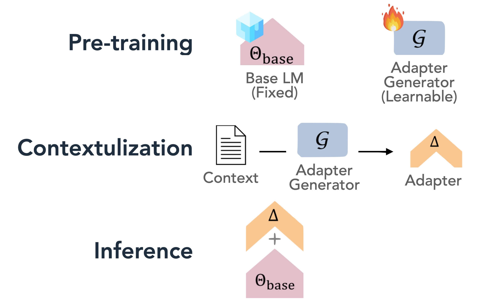

# 🚀 Generative Adapter

<div align="center">

[](https://arxiv.org/abs/2411.05877)

</div>


## ✨ Features

- 🔥 **Single Forward Pass**: Adapts to new context efficiently without multiple forward passes or retrieval.
- 🧠 **Context-Aware Adaptation**: Generates LoRA adapters dynamically based on the input context.
- 🎯 **Better Knowledge Integration**: Outperforms prompting and fine-tuning for knowledge injection within 8K tokens.

## 🎯 What is Generative Adapter?

<div align="center">
  
</div>

Generative Adapter is a method for adapting language models by generating LoRA adapters conditioned on the input context. It is more efficient than prompting and fine-tuning, and allows for stronger integration of new knowledge than continual pretraining within a limited token budget (e.g., 8K tokens). During inference, the generated adapters are merged into the model, enabling behavior similar to fine-tuned models while preserving the flexibility of prompting.

Compared to conventional solutions:

- Like prompting, it uses contextual information during inference, but introduces learnable components.
- Like fine-tuning, it adapts model behavior, but avoids modifying base model parameters.
- It supports a broad range of adaptation tasks, including updating factual knowledge, learning new tasks from a few examples, and maintaining long-term conversational memory.

## 🚀 Quick Start

### Installation

```bash
# Or install from source
git clone https://github.com/your-username/generative-adapter.git
cd generative-adapter
pip install -r requirements.txt
pip install -e .
```

### Basic Usage

see demonstration in `inference.ipynb`.


## 🛠️ Training

### Downloading Data

You can download the dataset used in our study from [Hugging Face Datasets](https://huggingface.co/datasets/generative-adaptor/generative-adapter-data):

```bash
git clone https://huggingface.co/datasets/generative-adaptor/generative-adapter-data data
```

This will save the dataset into a local folder named `data`.

---

### Pretraining

We pretrain using a dynamic LoRA generation strategy over 1B tokens from the SlimPajama dataset, which includes a diverse mix of sources: CommonCrawl (52.2%), C4 (26.7%), GitHub (5.2%), Books (4.2%), ArXiv (4.6%), Wikipedia (3.8%), and StackExchange (3.3%).

**Training Setup:**
* **Model**: Mistral-7B-Instruct-v0.2
* **Sequence Length**: 8K
* **Generative Adapter Rank**: 128
* **Generative Adapter Alpha**: 64
* **Learning Rate**: 5e-5
* **Batch Size (Global)**: 8
* **Training Steps**: 1B tokens

**Training Objective**:
We implement reconstruction and completion tasks by appending a copy of the input sequence to itself. To train the adapter generator, we split the combined sequence into 1K-token windows. For each window, we generate LoRA adapters based on all previous windows and dynamically merge them into the model to compute the next-token prediction.


```bash
cd scripts/train
bash pretrain.sh
```

---

### Instruction Tuning (SFT)

We fine-tune using tasks designed for long-context understanding:

**Datasets:**
COQA, DROP, NarrativeQA, MS MARCO, BookSum, LongAlpaca, MetaICL, QuAIL, PubMedQA

**SFT Setup:**

* **Base Model**: Pretrained FastLoRA checkpoint
* **Learning Rate**: 5e-5
* **Epochs**: 2
* **Batch Size**: 32

```bash
cd scripts/train
bash finetune.sh
```

---

### Custom Data Preparation

```bash
# Prepare pretraining data
cd scripts/data
bash prepare.sh

# Create instruction tuning data
ipython instruction-tuning-data-v4.ipynb
```


## 📖 Citation

If you find this work useful, please cite our paper:

```bibtex
@inproceedings{
chen2025generative,
title={Generative Adapter: Contextualizing Language Models in Parameters with A Single Forward Pass},
author={Tong Chen and Hao Fang and Patrick Xia and Xiaodong Liu and Benjamin Van Durme and Luke Zettlemoyer and Jianfeng Gao and Hao Cheng},
booktitle={The Thirteenth International Conference on Learning Representations},
year={2025},
url={https://openreview.net/forum?id=bc3sUsS6ck}
}
```